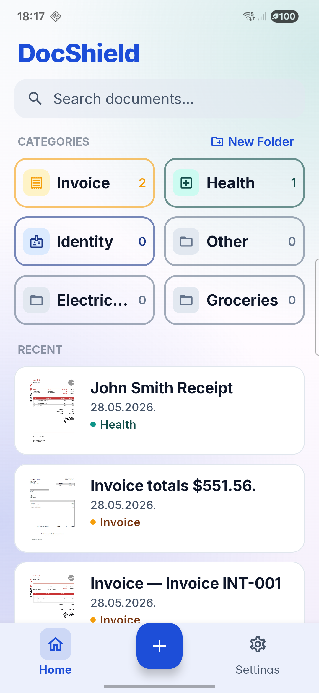
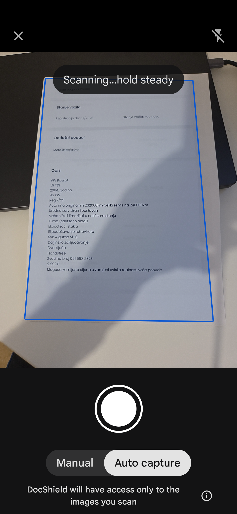
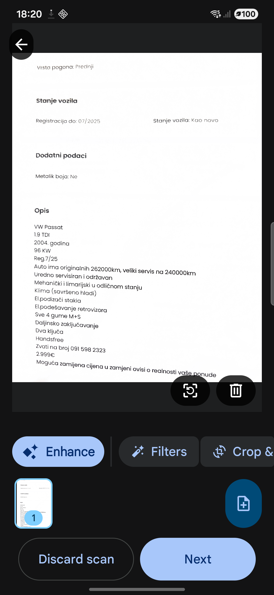
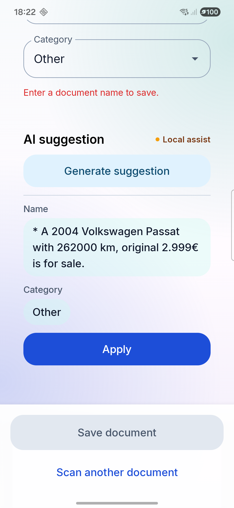
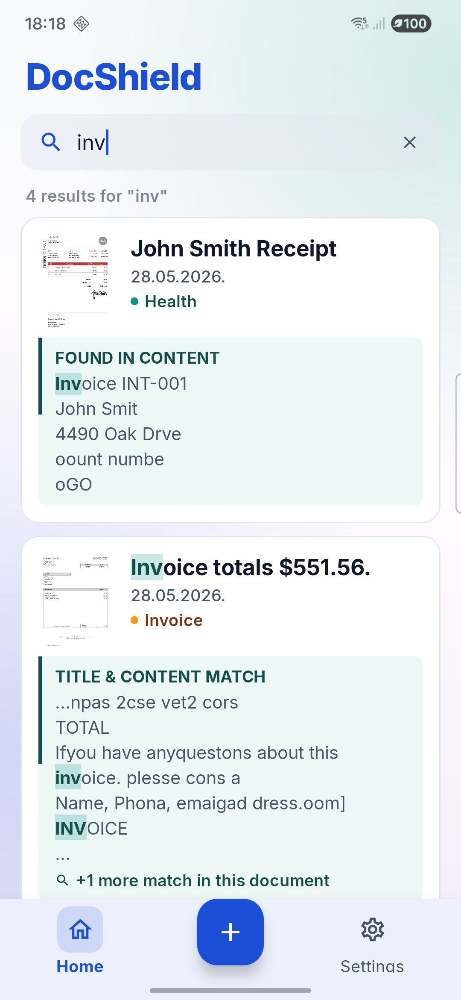
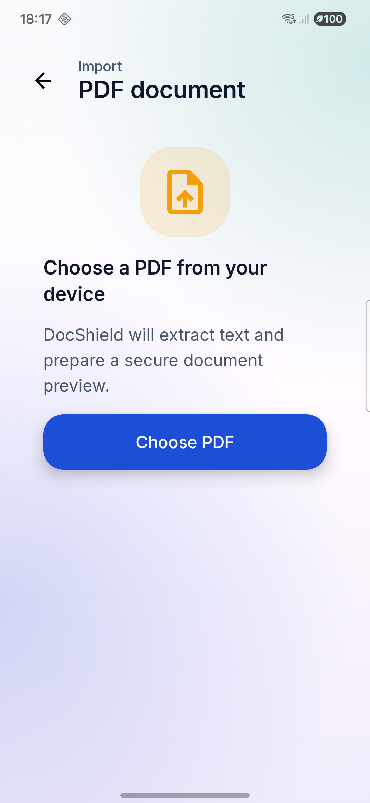

# DocShield

**Privacy-first, offline document vault for Android. Zero cloud. Zero tracking.**

> Scan, store, and search your sensitive documents — encrypted on your device, never leaving it.


---

## Screenshots

DocShield covers the full local document workflow: scan or import, extract OCR, categorize with on-device AI, and search privately.

| Home vault | Auto-capture scanner | Scan review |
|:----------:|:--------------------:|:-----------:|
|  |  |  |

| AI suggestions | Full-text search | PDF import |
|:--------------:|:----------------:|:----------:|
|  |  |  |

---

## Features

- **Document scanning** — ML Kit Document Scanner with automatic crop and perspective correction
- **On-device OCR** — full text extracted from every scan, indexed and searchable offline
- **Biometric lock** — BiometricPrompt + Android Keystore; app locks automatically when you leave
- **AES-256 encryption at rest** — SQLCipher, key stored in hardware-backed Android Keystore
- **On-device AI categorization** — 3-tier fallback chain, no internet required
- **Category folders** — built-in (Invoice, Health, Identity, Other) + custom user-created folders
- **PDF import** — import existing PDFs with automatic text extraction
- **Full-text search** — searches titles and OCR content, shows inline snippet with match highlighting
- **Sort & filter** — per-category sort by name or date
- **No internet permission. No analytics. No crash reporting.**

---

## Tech Stack

| Area | Technology |
|---|---|
| UI | Jetpack Compose + Material 3 |
| Architecture | MVVM + Clean Architecture |
| Dependency Injection | Hilt |
| Async | Kotlin Flow / StateFlow / Coroutines |
| Database | Room + SQLCipher (AES-256) |
| Key management | Android Keystore + EncryptedSharedPreferences |
| Authentication | BiometricPrompt |
| Document scanning | ML Kit Document Scanner |
| OCR | ML Kit Text Recognition |
| On-device AI | LiteRT-LM (Gemma 3 1B int4) → Gemini Nano → Rule-based |
| Image loading | Coil |
| PDF | PdfRenderer + ML Kit OCR fallback |
| Min SDK | API 29 (Android 10) |
| Language | Kotlin 2.3 |

---

## Architecture

DocShield follows Clean Architecture with a strict unidirectional dependency rule — outer layers depend inward, never the reverse.

```
Presentation  →  Domain  ←  Data
```

- **Domain** — pure Kotlin, zero Android imports. Models, repository interfaces, and use cases live here. Fully unit-testable without a device.
- **Data** — Room entities, ML Kit data sources, SQLCipher setup, Keystore key management. Implements domain interfaces.
- **Presentation** — Jetpack Compose screens and Hilt-injected ViewModels. Observes StateFlow, never touches data layer directly.

---

## Security Model

Security is the core of DocShield, not an afterthought.

| Concern | Implementation |
|---|---|
| Encryption at rest | SQLCipher with AES-256 |
| Key storage | Android Keystore (hardware-backed on supported devices) |
| Key protection | EncryptedSharedPreferences with AES256-GCM |
| Authentication | BiometricPrompt (fingerprint / face) |
| Auto-lock | Triggers on `onUserLeaveHint` — locks when app is backgrounded |
| Network | No `INTERNET` permission in manifest |
| Telemetry | No Firebase, no Analytics, no Crashlytics |

Everything stays on the device. There is no server, no account, no sync.

---

## On-Device AI

Document categorization uses a 3-tier fallback chain — the best available model runs automatically with no configuration needed.

```
1. LiteRT-LM  →  Gemma 3 1B int4, CPU/XNNPACK, ~250ms inference
2. Gemini Nano  →  on supported devices (Pixel 8+, Galaxy S24+)
3. Rule-based  →  keyword matching, zero dependencies, always works
```

No API key. No cloud call. No data ever leaves the device.

---

## Getting Started

```bash
git clone https://github.com/antebakotaservices-web/DocShield.git
```

1. Open in **Android Studio Meerkat** or newer
2. Connect a physical device (API 29+) — biometric features require real hardware
3. Build and run — no API keys or configuration required

> **Note:** On-device LLM inference (LiteRT-LM) requires the model file to be pushed to the device manually:
> `adb push gemma3-1b-it-int4.litertlm /data/data/com.digitaldude.docshield/files/`
> Without it, the app falls back automatically to rule-based categorization.
